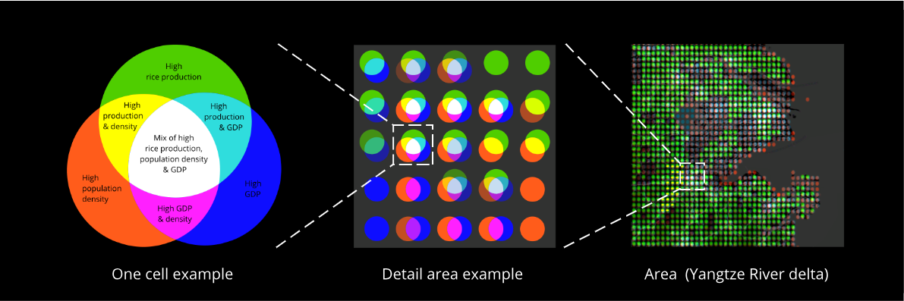
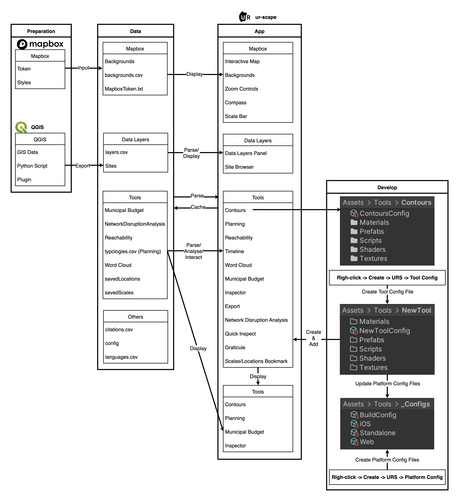

# Summary

The growing technical sophistication of city planning software [@Bettencourt:2010],[@Batty:2013] has produced increasingly specialised work flows that tend to alientate, rather than engage, stakeholders [@Batty:2021], [@Barns:2019], [@Yap:2022]. This contradicts the basic purpose of such software – or Planning Support Systems (PSS) – to improve the sustainability and long-term resilience of cities by harnessing increasing volumes of digital data to encourage greater stakeholder participation in city-making processes [@Maliene:2011], [@Flacke:2020], [@Geertman:2009], [@Danbi:2014], [@Zwick:2010], [@Haddad:2012], [@Richthofen:2022]. 

The disconnection of data from stakeholder is especially debilitating for rapidly urbanising regions in Asia and Africa. Cities in these regions are growing at unprecedented rates [UN:2018] and typically mix both formal and informal, urban and rural land-uses. The uneven, dynamic and ambiguous settlement patterns that result are not always readily described with definitive, boundary-oriented and line-based graphical conventions. The policy makers, developers, investors, civil society actors, academics and the general public here urgently need access to reliable data in appropriate formats to support the planning of their cities and regions. 

# Statement of need

ur-scape is an open-source planning support software designed to respond to the challenges of rapid urbanisation in Asia and Africa. Supported by Unity game-engine, ur-scape aims to improve stakeholder access to data through an innovative data rendering format and an intuitive UI/UX concept.

The data rendering format prioritises (raster-based) continuous grid-based data fields and their intersections over (vector-based) high-precision of object placement and boundaries. We call this techniques ‘gridded Venn diagrams’ (Figure 1). ur-scape displays gridded data with an additive colour-mixed Venn diagrammatic representation at each centroid. Each coloured circle in the Venn diagram carries data from a given data set, be it population density, poverty, night-light, or CO2 emissions. As each centroid can accommodate a theoretically infinite number of colour-mixed circles arrayed around it, this rendering format facilitates layering and viewing multiple datasets at once. By avoiding the cumbersome data layering techniques typical of current PSS (through manipulations of opacity and transparency levels), this format encourages rapid and simple analyses of diverse kinds of data.

<figcaption>Figure 1. Illustrations of gridded Venn diagram concept at various scales.
</figcaption> 

This approach is combined with an intuitive UI/UX concept based on simple and well-known gesture-based interaction formats – touch, pinch, zoom. The interaction concept is supported by a range of intuitive analytical tools – such as contouring of multiple geospatial dataset intersections, transects and dissects – that make the most of the gridded Venn diagram approach in combination with multiple base maps (satellite, cadastral, traffic, and OSM). Ultising Unity’s processing and rendering capability, ur-scape is able to dynamically adjust image resolution based on the zoom level (i.e. extent of the dataset) to provide a fluent and seemless user experience even with large global datasets. Detailed descriptions and how-to instructions can be found in our website: https://ur-scape.sec.sg/en/Tutorials 

This gives ur-scape a number of advantages over conventional planning support software:
1) Integrates data management. Metadata input is mandatory and built-in in to ur-scape's import procedure which ensures that users develop the habit of initiating and maintaining accurate metadata. This is particularly needed in the rapidly urbanising regions in Asia and Africa.

3) Supports problem-setting and problem-solving. The inclusion of data of varying quality is often more effective is shaping agendas than high object- and boundary-precision data [@Pelzer:2013]. This approach supports users to shape and prioritise problem statements based on the dynamic geographical, institutional and data contexts in which they are working.

5) Offers quick access for non-expert. The intuitive UI/UX does not require users to undergo intensive training, so facilitates almost immediate interaction between expert and non-expert around real-time spatial data (Figure 2).

7) Enhances iterative experimentation with best available data. ur-scape encourages users to make best use of uneven data quality by enabling rapid and repeated trialling of diverse data sets, including the use of data proxies where bespoke data is not available.

<figcaption>Figure 2. A conceptual comparison between conventional work and ur-scape workflow involving data and disciplinary-specific experts.
</figcaption> 

# Use cases

ur-scape was developed in collaboration with a number of government agencies and multilateral institutions in East, South and Southeast Asia which were addressing a range of practical challenges concerning rapid urbanisation. For example, ur-scape was deployed in a number of projects such as gender equality and female empowerment in Bundung, Indonesia [@ADB:2019], spatial planning during COVID-19 pandemic [@FCL:2021], urban resilience [@Urban:2021], and slum assessment [@Slum:2021].

# urscape architecture

ur-scape was developed in both game engine (Unity) and web-based environments. The desktop game-engine-enabled version supports real-time rendering. The desktop-based version compatible with a variety of platforms including Windows, MacOS, and Web is currently under development.

Generally, ur-scape is structured under four key components: preparation, data, app, and develop (Figure 3). In the preparation stage, users interact with Mapbox to prepare the custom base maps they wish to render in the application (https://ur-scape.sec.sg/en/Tutorials/Create_a_Custom_Map_in_Mapbox). In the current version of ur-scape (version 0.9.95), users also rely on QGIS to prepare and export both raster and vector data to a .csv format (https://ur-scape.sec.sg/en/Installation/QGIS_Plugin_Installation). Metadata input is a required step when importing data into ur-scape. In the Data stage, data from the previous stage (i.e. csv files) are placed in ur-scape’s Data folder along with other data files (i.e. in-built tools and application configuration data files) used for the application’s interpretation. This leads to the App stage whereby the application interprets all the data files and renders them on an interactive map (set up via Mapbox during the initial installation of ur-scape). A list of sites containing data layers are also available for users to interact with. Site panel is a useful feature for projects involving local datasets with different data layer categories or in a different language.

Users can make use of the in-built tools to interact with and analyse the GIS data. Currently, ur-scape supports a total number of 11 tools with various complexity and data requirements (https://ur-scape.sec.sg/en/User_Guide/ur-scape/Tools_Panel). The folder structure of existing and new tools, as well as the application’s platform configuration files are illustrated in Figure 3.

<figcaption>Figure 3. Core components and folder structure of ur-scape software.
</figcaption> 

# Future developments

The development of ur-scape is based on the integrated socio-technical goals outlined above and is guided by three principles: streamlined workflow (i.e. bypassing QGIS importer), web-friendly (i.e. browser-based), open-ended (i.e. be able to export results as GIS datasets such as geotiff or geojson). 

# References
