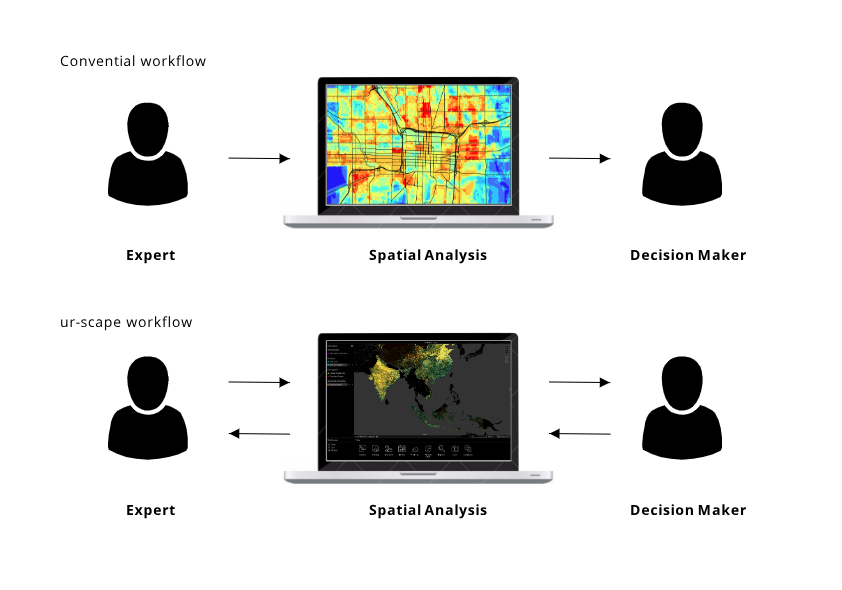

# Summary

The benefits of maps and spatial data have long been recognized and appreciated (Batty et al., 1998). Particularly in urban planning and landscape design, the process of rendering, overlaying, and analysing spatial data is intuitively appealing among researchers, planners, and policy makers. Urban design and planning process, as many scholars and practitioners have noticed in the past few decades (Maliene et al. 2011), involves groups of individuals from vastly diverse backgrounds. The consequences of such a process are also direct and apparent to the general public. Therefore, more often than not, the planning process needs to be participatory, engaging, and multidisciplinary.  As more datasets and models become available, one main obstacle in creating such a workflow is increasingly dependent on how data handlers communicate and present information to a broad-based audience across multiple disciplines and the public.

# Statement of need

ur-scape is designed to promote data-evident planning, particularly within the South East Asia context. Specifically, the platform assists three aspects of the decision-making process: interaction, transparency, and organisation. ur-scape’s interface enables decision-makers to have more direct first-hand interactions with multi-sourced data and analytical processes without undergoing intensive training (Figure 1). This workflow therefore increases the transparency and provides data evidence to support and communicate decisions with stakeholders and the general public. Lastly, although ur-scape is fundamentally a mapping platform, its structure also encourages clean and logical data organisation and management, both of which based on our experience have been a challenging task for many municipalities in South East Asia, partially due to its fast and dynamic urbanisation environments. 

In 2019, together with the Asian Development Bank, ur-scape was implemented in a number of collaborative projects such as gender equality and female empowerment in Bundong, Indonesia (ADB 2019), spatial planning during COVID-19 pandemic (Future Cities Laboratory Global, 2021), urban resilience (Livable Settlements Investment Project, 2021a), and slum assessment (Livable Settlements Investment Project, 2021b).

<figcaption>Figure 1. A conceptual comparison between conventional work and ur-scape workflow involving data and disciplinary-specific experts</figcaption> 

# urscape architecture

ur-scape is a support tool, developed using the Unity engine, for planning and design of rapidly developing towns, cities and regions. Unity enables real-time rendering and is compatible with a variety of platforms including Windows, MacOS, and Web (currently under development). 
Generally, ur-scape is structured under four key components: preparation, data, app, and develop (Figure 2). In the preparation stage, users interact with Mapbox to prepare the custom base maps they wish to render in the application (https://ur-scape.sec.sg/en/Tutorials/Create_a_Custom_Map_in_Mapbox). In the current version of ur-scape (version 0.9.95), users also rely on QGIS to prepare and export GIS data to a .csv format (https://ur-scape.sec.sg/en/Installation/QGIS_Plugin_Installation). Metadata input is a required step when importing data into ur-scape. In the Data stage, data from the previous stage (i.e. csv files) are placed in ur-scape’s Data folder along with other data files (i.e. in-built tools and application configuration data files) used for the application’s interpretation. This leads to the App stage whereby the application interprets all the data files and renders them on an interactive map (set up via Mapbox during the initial installation of ur-scape). A list of sites containing data layers are also available for users to interact with. Site panel is a useful feature for projects involving local datasets with different data layer categories or in a different language. 
 
Users can make use of the in-built tools to interact with and analyse the GIS data. Currently, ur-scape supports a total number of 11 tools with various complexity and data requirements (https://ur-scape.sec.sg/en/User_Guide/ur-scape/Tools_Panel). The folder structure of existing and new tools, as well as the application’s platform configuration files are illustrated in Figure 2.

<figcaption>Figure 2. Core components and folder structure of ur-scape software.</figcaption> 

# Future developments

ur-scape’s future development is guided by three principles: streamlined workflow (i.e. bypassing QGIS importer), web-friendly (i.e. browser-based rather than desktop-based), open-ended (i.e. be able to export results as data layer such as geotiff or geojson, rather than an image or PDF).

# References

Asian Development Bank (ADB), 2019, Promoting Gender Equality and Women's Empowerment (Phase 2): Future Cities, Future Women Initiative Bandung Consultant’s Report. Prepared by  Singapore ETH Center (SEC) Future Cities Laboratory (FCL). https://www.adb.org/projects/documents/reg-48206-001-tacr-3

Batty, M; Dodge, M; Jiang, B; Hudson-Smith, A; (1998) GIS and urban design. (CASA Working Paper 3). UCL (University College London), Centre for Advanced Spatial Analysis (UCL): London. https://discovery.ucl.ac.uk/id/eprint/224

Future Cities Laboratory Global (2021). Manual on Leveraging Spatial Data for Pandemic-Resilient Cities (Report). ADB
https://events.development.asia/system/files/materials/2021/06/202106-manual-leveraging-spatial-data-pandemic-resilient-cities.pdf

Livable Settlements Investment Project (2021a). Urban Resilience Assessment of Cirebon City (Report). ADB
https://www.livingcities.se/uploads/1/5/3/3/15335706/cirebon_urban_resilience_assessment_-_adb_lsip.pdf

Livable Settlements Investment Project (2021b). Slum Assessment for Makassar City (Report). ADB
https://www.livingcities.se/uploads/1/5/3/3/15335706/lsip_makassar_report_eng.pdf

Maliene, V., Grigonis, V., Palevičius, V. et al. Geographic information system: Old principles with new capabilities. Urban Design International 16, 1–6 (2011). DOI:https://doi.org/10.1057/udi.2010.25

