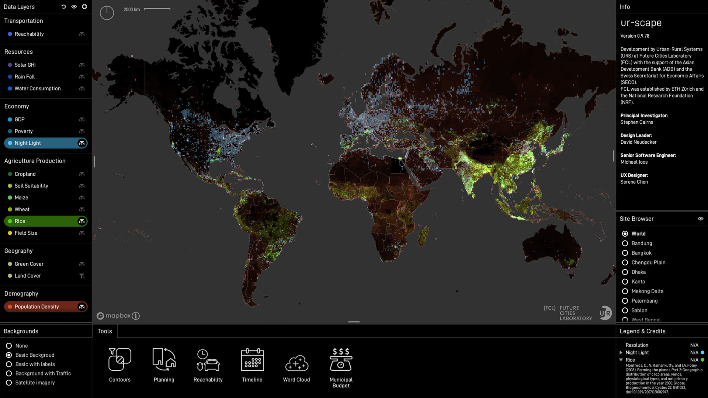
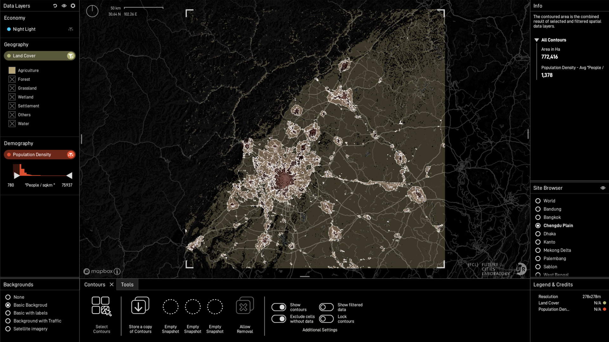

# ur-scape

Support tool for planning and design of rapidly developing towns, cities and regions. Supported by Unity game-engine, ur-scape aims to improve stakeholder access to data and high-level analysis functions through an innovative data rendering format and an intuitive UI/UX concept. 

Development by Urban-Rural Systems (URS) (now known as [Agropolitan Territories](https://fcl.ethz.ch/research/food-and-territories/agropolitan-territories-of-monsoon-Asia.html)) at [Future Cities Laboratory (FCL)](https://fcl.ethz.ch/) with the support of the [Asian Development Bank (ADB)](https://www.adb.org/) and the [Swiss Secretariat for Economic Affairs (SECO)](http://www.seco.admin.ch). FCL was established by ETH Zürich and the National Research Foundation (NRF) in Singapore.

Please contact the project lead Dr. Stephen Cairns (cairns@arch.ethz.ch) for any potential collabration and development opportunties. 

If you would like report a bug or have trouble installing/using the software, please contact the ur-scape team (ur-scape@sec.ethz.ch).

### Download

🌐 Visit the ur-scape website at [ur-scape.com](https://ur-scape.com).

👩‍💻 Download binaries for Windows and macOS at [the Getting Started page](https://ur-scape.com/download/).

### Screenshots

### Requisites

Hardware:
* DirectX11 capable GPU

Software:
* [Unity](https://unity.com/) 2020.1.2f1
* [Mapbox](https://www.mapbox.com/) account

### Setup

 * Create a Mapbox account
 * Create a new file called *MapboxToken.txt* inside the *Data* folder
 * Paste your Mapbox token into *MapboxToken.txt*

*(Visit ur-scape's [Wiki](https://ur-scape.sec.sg/en/Installation/Mapbox_Setup) for more info)*

### Team

* Stephen Cairns (Principal Investigator)
* David Neudecker (Design Leader)
* Niraly Mangal (Doctoral Researcher)
* Joshua Vargas (Research Assistant)
* Denise Lee (Researcher)
* Pari Sen Biswas (Student Research Assistant)
* Darshan Lineswala (Student Research Assistant)
* Michael Joos (Senior Software Engineer)<!--: joos@arch.ethz.ch-->
* Serene Chen (UX Designer)
* Muhammad Salihin Bin Zaol-kefli (Software Engineer)
* Yuhao Lu (Former Project Coordinator)

### Documentation

For more information please head to ur-scape's [Wiki](https://wiki.ur-scape.com).

### ur-scape studio

Learn how to use ur-scape at [ur-scape studio](https://studio.ur-scape.com), the online learning platform for ur-scape.

### Contributing

1. Fork this repository
2. Create your feature branch (`git checkout -b my-new-feature`)
3. Commit your changes (`git commit -am 'Added some feature'`)
4. Push to the branch (`git push origin my-new-feature`)
5. Create new Pull Request

### License

ur-scape is distributed under the [MIT license](https://en.wikipedia.org/wiki/MIT_License) (see the [LICENSE](./LICENSE) file)

### 3rd-Party Licenses

This software is based in part on the following 3rd-party libraries:

[Unity Standalone File Browser](Assets/3rdParty/StandaloneFileBrowser/LICENSE.txt)
> 
Copyright (c) 2017 Gökhan Gökçe
https://github.com/gkngkc/UnityStandaloneFileBrowser
MIT License

[LibTiff.Net](Assets/3rdParty/LibTiff.NET/license.txt)
> 
Copyright (c) 2008-2019 Bit Miracle
https://bitmiracle.com/libtiff/
New BSD license

[SimpleJSON](Assets/3rdParty/SimpleJSON/LICENSE)
> 
Copyright (c) 2012-2017 Markus Göbel (Bunny83)
https://simplejson.readthedocs.io/en/latest/
MIT License

[Catfood.Shapefile](Assets/3rdParty/Catfood.Shapefile/LICENSE.txt)
> 
Copyright (c) 2009-2019 Robert Ellison and contributors
https://github.com/abfo/shapefile
Microsoft Public License (Ms-PL)

The terms of the licenses of all third-party libraries can also be found in [LICENSE-3RD-PARTY](./LICENSE-3RD-PARTY)
